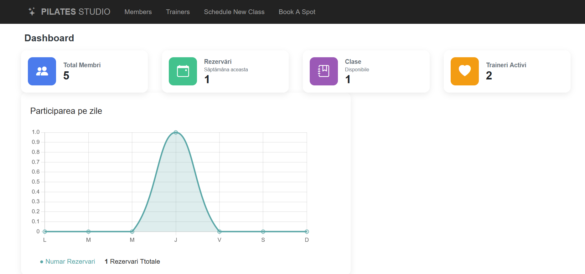
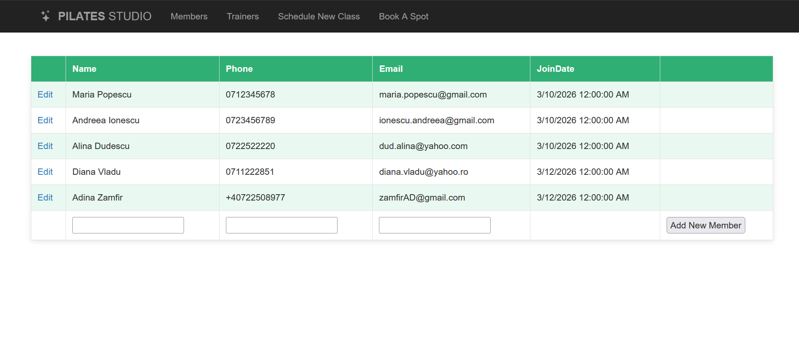
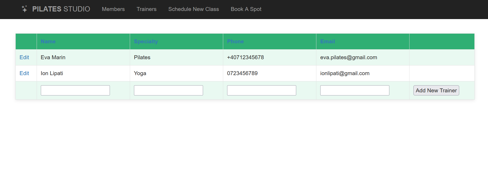
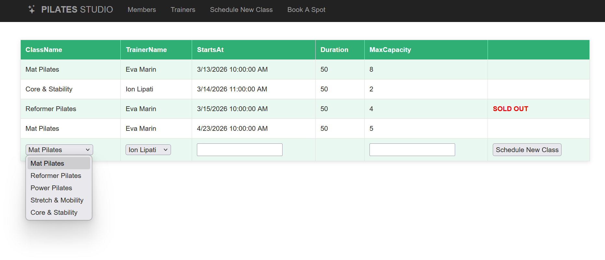
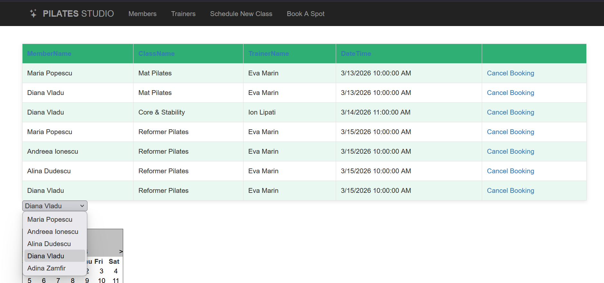
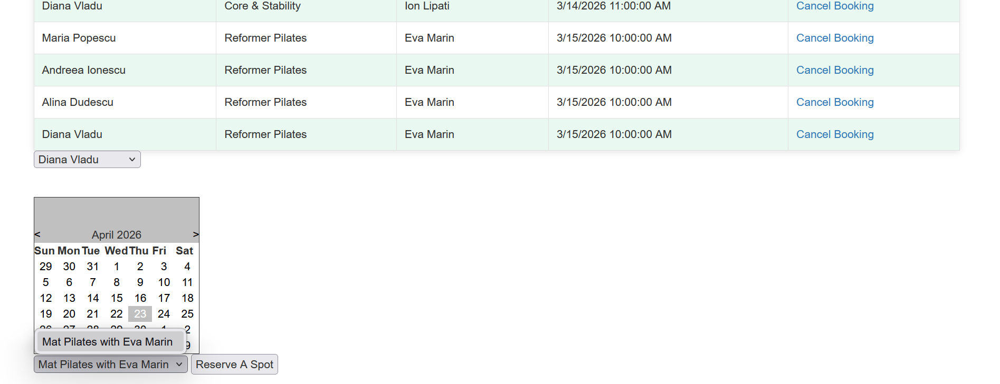

# Pilates-Studio-Management

A web application built with ASP.NET for managing a Pilates studio.

## Overview

The home page features a real-time dashboard with key performance indicators:
- Total number of members
- Total number of trainers
- Number of available classes for the current week
- Number of bookings made during the current week

In addition, the dashboard includes a line chart that visualizes booking density per day for the current week, helping track studio activity trends over time.

## Features

### Dashboard
- KPI cards for core metrics
- Weekly booking analytics displayed as a line chart

### Members Management
- View all members in a tabular GridView
- Add new members via a dedicated form/button
- Edit existing member information
- Member data includes: name, phone, email, join date

### Trainers Management
- View all trainers in a tabular GridView
- Add new trainers via a dedicated form/button
- Edit trainer information
- Trainer data includes: name, specialty, phone, email

### Class Scheduling
- View all classes in a tabular GridView
- Add new classes with:
  - Class name (dropdown)
  - Trainer (dropdown)
  - Start time
  - Duration (auto-completed)
  - Maximum capacity
- Automatically marks classes as **SOLD OUT** when capacity is reached
- Sold-out classes are no longer available for booking

### Booking System
- View all bookings in a GridView (member, class, trainer, date & time)
- Cancel bookings via dedicated action button
- Create new bookings through a guided flow:
  1. Select a member (dropdown)
  2. Choose a preferred date from a calendar
  3. Select an available class for that day (dropdown - filtered dynamically)
- If no classes are available for a selected day, no options are shown

## Database

The `Database/` folder contains SQL and PL/SQL scripts used to define the database structure and logic, including table creation and stored procedures.

## Tech Stack
- ASP.NET Web Forms (C#)
- HTML / CSS / Bootstrap
- JavaScript / jQuery
- Chart.js (for data visualization)
- Visual Studio

## Notes
This is a learning project developed as part of a database/web development course.

---